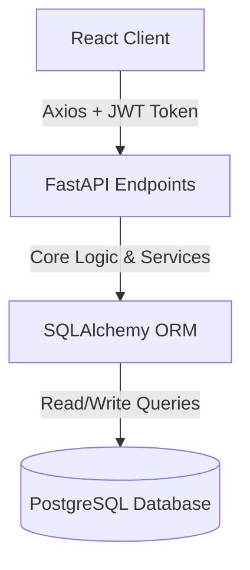

# 🎓 round 2 Viva Preparation Guide — Mini ERP (Shiv Furniture Works)

This guide provides a comprehensive breakdown of every file in the codebase, key architectural details, business logic rules, and potential questions for your **Round 2 Viva**.

---

## 🏗️ 1. Core Architecture & Technologies

### Tech Stack Summary
*   **Backend**: **FastAPI** (Python REST API), **Uvicorn** (ASGI server), **SQLAlchemy** (ORM), and **Alembic** (database migrations).
*   **Frontend**: **React** (Vite build tool), **TailwindCSS** (styling layer), **TanStack Query / React Query** (API state sync & caching), and **React Router 6** (routing).
*   **Database**: **PostgreSQL** (relational storage).

### System Data Flow

---

## 💡 2. Key Business Logic Concepts (Crucial for Viva)

### A. The Stock Allocation Formula
The database keeps track of three critical numbers for inventory levels of any product:
1.  **On Hand Quantity (`on_hand_qty`)**: The actual physical inventory currently sitting inside the warehouse.
2.  **Reserved Quantity (`reserved_qty`)**: Stock committed to confirmed Sales Orders (SO) or Manufacturing Orders (MO) that haven't been dispatched/consumed yet.
3.  **Free to Use Quantity (`free_to_use_qty`)**: The remaining stock available to sell or use:
    $$\text{free\_to\_use\_qty} = \text{on\_hand\_qty} - \text{reserved\_qty}$$

### B. Auto-Procurement Engine (MTS vs. MTO)
This is the standout feature of this ERP. When an order is confirmed, the procurement engine ([procurement.py](file:///d:/Odoo_Hackathon_KAHE/backend/app/services/procurement.py)) evaluates:
*   **MTO (Make to Order)**: Products are manufactured/purchased *only when* a customer order demands them. The system checks stock; if insufficient, it triggers a Purchase Order (PO) or a Manufacturing Order (MO) immediately, linking them to the Sales Order.
*   **MTS (Make to Stock)**: Products are produced to maintain a minimum stock. If `free_to_use_qty` drops below the **Reorder Point**, the system automatically places an order for the **Reorder Quantity**.

---

## 🐍 3. Backend Codebase Directory Breakdown

### 📂 App Configuration & Startup
*   [main.py](file:///d:/Odoo_Hackathon_KAHE/backend/app/main.py): Entry point of the FastAPI application. Sets up CORS policies, registers all endpoints/routers, and configures startup events (e.g. database schema creation).
*   [database.py](file:///d:/Odoo_Hackathon_KAHE/backend/app/database.py): Configures the database connection. Creates the SQLAlchemy engine, configures connection pool parameters, and defines `get_db()`, which yields database sessions to endpoints.
*   [config.py](file:///d:/Odoo_Hackathon_KAHE/backend/app/config.py): Manages environment variables (e.g. connection strings, JWT secrets) using `pydantic_settings.BaseSettings`.

### 📂 Core (Security & Authentication Middleware)
*   [deps.py](file:///d:/Odoo_Hackathon_KAHE/backend/app/core/deps.py): Contains FastAPI dependencies like `get_current_user`, which decodes JWT headers, validates token integrity, and checks user authorization roles.
*   [security.py](file:///d:/Odoo_Hackathon_KAHE/backend/app/core/security.py): Handles security operations, specifically password hashing/salting via `bcrypt` and encoding JWT tokens.

### 📂 Models (SQLAlchemy Database Schemas)
*   [user.py](file:///d:/Odoo_Hackathon_KAHE/backend/app/models/user.py): Defines the `User` table (ID, Name, Email, Hashed Password, and Role (e.g., admin, owner, sales)).
*   [customer.py](file:///d:/Odoo_Hackathon_KAHE/backend/app/models/customer.py) & [vendor.py](file:///d:/Odoo_Hackathon_KAHE/backend/app/models/vendor.py): Define buyer and supplier contacts (Names, Emails, Phones, Addresses).
*   [product.py](file:///d:/Odoo_Hackathon_KAHE/backend/app/models/product.py): Defines the product inventory master list. Stores costs, prices, stock levels (`on_hand`, `reserved`), procurement fields, and records stock movements.
*   [sales.py](file:///d:/Odoo_Hackathon_KAHE/backend/app/models/sales.py): Represents customer invoices. Defines `SalesOrder` and `SalesOrderLine` tables.
*   [purchase.py](file:///d:/Odoo_Hackathon_KAHE/backend/app/models/purchase.py): Handles material supply. Defines `PurchaseOrder` and `PurchaseOrderLine` tables.
*   [manufacturing.py](file:///d:/Odoo_Hackathon_KAHE/backend/app/models/manufacturing.py): Governs assembly. Defines `BOM`, `BOMLine`, `BOMOperation`, `ManufacturingOrder`, `ManufacturingOrderComponent`, `WorkOrder`, and `WorkCenter` tables.
*   [audit.py](file:///d:/Odoo_Hackathon_KAHE/backend/app/models/audit.py): Logs system events for traceability (timestamps, actions like `CONFIRM` or `DELETE`, active users, and modified JSON diffs).

### 📂 Schemas (Pydantic Input/Output Validation)
*   These files define Pydantic models to validate API requests (incoming payloads) and format API responses (outgoing JSON serialization). 
*   Includes `user.py`, `customer.py`, `vendor.py`, `product.py`, `sales.py`, `purchase.py`, and `manufacturing.py`.

### 📂 Services (Business Logic Engines)
*   [stock.py](file:///d:/Odoo_Hackathon_KAHE/backend/app/services/stock.py): Houses calculations for modifying on-hand/reserved inventory and registering movements in the `stock_ledger` table.
*   [procurement.py](file:///d:/Odoo_Hackathon_KAHE/backend/app/services/procurement.py): Runs the automated MTS / MTO auto-ordering calculations when orders are confirmed.
*   [sequence.py](file:///d:/Odoo_Hackathon_KAHE/backend/app/services/sequence.py): Simple helper class that generates formatted invoice reference codes (e.g. `SO-0001`, `PO-0001`, `MO-0001`).
*   [audit.py](file:///d:/Odoo_Hackathon_KAHE/backend/app/services/audit.py): Helper to quickly insert records into the `audit_log` table.

### 📂 Routers (REST Endpoints)
These handle request routing, parameters extraction, database session management, and call the service layers:
*   [auth.py](file:///d:/Odoo_Hackathon_KAHE/backend/app/routers/auth.py): Log-in, sign-up, and session endpoints.
*   [products.py](file:///d:/Odoo_Hackathon_KAHE/backend/app/routers/products.py): Product CRUD endpoints, plus stock level manually-triggered adjustments.
*   [sales.py](file:///d:/Odoo_Hackathon_KAHE/backend/app/routers/sales.py): Manages Sales Order lifecycle (Draft $\to$ Confirmed $\to$ Dispatched).
*   [purchase.py](file:///d:/Odoo_Hackathon_KAHE/backend/app/routers/purchase.py): Purchase Order execution (Draft $\to$ Confirmed $\to$ Received).
*   [manufacturing.py](file:///d:/Odoo_Hackathon_KAHE/backend/app/routers/manufacturing.py): Oversees MOs, routing operations, work center statuses, and BOM settings.
*   [vendors.py](file:///d:/Odoo_Hackathon_KAHE/backend/app/routers/vendors.py) & [customers.py](file:///d:/Odoo_Hackathon_KAHE/backend/app/routers/customers.py): Contact directories.
*   [dashboard.py](file:///d:/Odoo_Hackathon_KAHE/backend/app/routers/dashboard.py): Returns aggregated stats (e.g., total sales, pending receipts) for dashboard cards.
*   [audit.py](file:///d:/Odoo_Hackathon_KAHE/backend/app/routers/audit.py): Returns chronological activity tables to administrators.

---

## ⚛️ 4. Frontend Codebase Directory Breakdown

### 📂 Routing & Contexts
*   [App.jsx](file:///d:/Odoo_Hackathon_KAHE/frontend/src/App.jsx): Main router structure. Uses React Router 6. Defines which endpoints load which pages. Wraps secure screens in `PrivateRoute` blocks to block unauthorized guests.
*   [AuthContext.jsx](file:///d:/Odoo_Hackathon_KAHE/frontend/src/context/AuthContext.jsx): Global React state provider that tracks the active logged-in user, credentials, role, and handles `login` / `logout` actions. Saves session tokens in `localStorage`.
*   [client.js](file:///d:/Odoo_Hackathon_KAHE/frontend/src/api/client.js): Configures Axios with a base backend URL. Automatically attaches the JWT authorization bearer token to every outgoing API request.
*   [Layout.jsx](file:///d:/Odoo_Hackathon_KAHE/frontend/src/components/Layout.jsx): The master page shell. Renders the interactive dark-navy sidebar, breadcrumbs title bar, mobile sidebar triggers, and user profile badges.

### 📂 Interface Pages (`frontend/src/pages/`)
*   [LoginPage.jsx](file:///d:/Odoo_Hackathon_KAHE/frontend/src/pages/LoginPage.jsx) & [SignupPage.jsx](file:///d:/Odoo_Hackathon_KAHE/frontend/src/pages/SignupPage.jsx): Premium split-screen forms for authenticating users.
*   [Dashboard.jsx](file:///d:/Odoo_Hackathon_KAHE/frontend/src/pages/Dashboard.jsx): Fetches and displays statistics summaries, system greetings, and overall statistics.
*   [ProductsPage.jsx](file:///d:/Odoo_Hackathon_KAHE/frontend/src/pages/products/ProductsPage.jsx): Tabulates active products, stock on-hand, strategy metrics, and includes modals for manual inventory counts.
*   [SalesPage.jsx](file:///d:/Odoo_Hackathon_KAHE/frontend/src/pages/sales/SalesPage.jsx) & [PurchasePage.jsx](file:///d:/Odoo_Hackathon_KAHE/frontend/src/pages/purchase/PurchasePage.jsx): Tables for sales orders and purchase orders with action buttons for confirming or canceling.
*   [ManufacturingPage.jsx](file:///d:/Odoo_Hackathon_KAHE/frontend/src/pages/manufacturing/ManufacturingPage.jsx): Manages factory floor operations and tracks scheduled runs.
*   [VendorsPage.jsx](file:///d:/Odoo_Hackathon_KAHE/frontend/src/pages/vendors/VendorsPage.jsx) & [CustomersPage.jsx](file:///d:/Odoo_Hackathon_KAHE/frontend/src/pages/customers/CustomersPage.jsx): Modern directories mapping contact details in responsive visual cards.
*   [AuditPage.jsx](file:///d:/Odoo_Hackathon_KAHE/frontend/src/pages/AuditPage.jsx): Shows database action tables (available only to `admin` roles).
*   [SalesOrderDetail.jsx](file:///d:/Odoo_Hackathon_KAHE/frontend/src/pages/sales/SalesOrderDetail.jsx) & [PurchaseOrderDetail.jsx](file:///d:/Odoo_Hackathon_KAHE/frontend/src/pages/purchase/PurchaseOrderDetail.jsx): Detail metrics inside grid structures, featuring quantity dispatches/receipts input logs, full breadcrumb navigation, and order remarks.
*   [MODetail.jsx](file:///d:/Odoo_Hackathon_KAHE/frontend/src/pages/manufacturing/MODetail.jsx): Shows target outputs, raw material requirements, and operational steps.
*   [BOMPage.jsx](file:///d:/Odoo_Hackathon_KAHE/frontend/src/pages/manufacturing/BOMPage.jsx): Bill of Materials configuration page. Includes complex multi-input modals to define new product recipes.

---

## ❓ 5. Sample Viva Questions & Answers

#### Q1: What is the difference between `on_hand_qty` and `free_to_use_qty`?
*   **Answer**: `on_hand_qty` is the physical quantity of a product currently present in the warehouse. `free_to_use_qty` represents what is actually available for new orders. It is calculated by subtracting `reserved_qty` (stock allocated to confirmed sales or manufacturing orders that are not yet shipped/consumed) from `on_hand_qty`.

#### Q2: How does the system handle authorization?
*   **Answer**: We use role-based access control (RBAC). In the database, the `User` model has a `role` field (e.g. `admin`, `sales`, `purchase`). On the backend, dependencies inside [deps.py](file:///d:/Odoo_Hackathon_KAHE/backend/app/core/deps.py) intercept requests and verify roles. On the frontend, [App.jsx](file:///d:/Odoo_Hackathon_KAHE/frontend/src/App.jsx) uses role checks to guard pages like the `AuditPage` (admin-only).

#### Q3: What is TanStack Query / React Query used for in the frontend?
*   **Answer**: TanStack Query is used to fetch, cache, and update server state in our React application. Instead of managing fetch states manually with `useEffect` and local state, TanStack Query handles caching, automatic re-fetching on mutations, loading skeleton states, and data synchronization between our backend and frontend.

#### Q4: How does the auto-procurement engine run?
*   **Answer**: When a Sales Order is confirmed, the procurement service evaluates the procurement strategy of each ordered product. If a product is MTO (Make-to-Order) and stock is insufficient, it automatically creates a corresponding Purchase Order (if it is a raw material) or a Manufacturing Order (if it is a finished product). If the strategy is MTS (Make-to-Stock) and confirming the order causes the `free_to_use` stock to fall below the product's safety threshold (`reorder_point`), it triggers a replenishment order.

#### Q5: What database library and migration tools are you using?
*   **Answer**: We use **SQLAlchemy** as our Object-Relational Mapper (ORM) to define tables as Python classes and query database records using Python code. We use **Alembic** to manage database migrations, which allows us to track and apply database schema changes over time.
